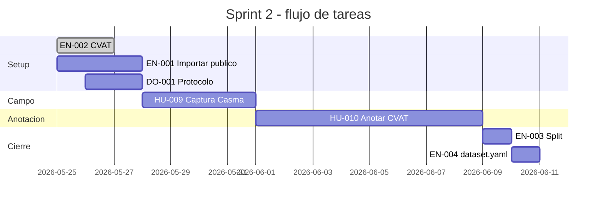

# Sprint 2 — Construcción del Dataset

| Campo | Valor |
|---|---|
| Sprint | 2 de 5 |
| Duración planificada | 3 semanas (Semanas 4 a 6) |
| SP planificados | 39 |
| Sprint Goal | Tener un dataset híbrido (público + propio) de ≥ 768 imágenes anotadas y dividido en train/val/test, listo para entrenar modelos en Sprint 3. |

## PBIs del Sprint

| ID | Título | SP | Estado | Evidencia |
|---|---|---|---|---|
| EN-001 | Importar Dataset Público de Mango (ya existente, formato YOLO) | 5 | ⏳ | — |
| EN-002 | Instalar y Configurar CVAT | 3 | ⏳ | — |
| DO-001 | Documentar Protocolo de Captura de Campo | 3 | ⏳ | — |
| HU-009 | Realizar Sesiones de Captura en Casma | 8 | ⏳ | — |
| HU-010 | Anotar Imágenes con Bounding Boxes (CVAT → YOLO) | 13 | ⏳ | — |
| EN-003 | Dividir Dataset en Train / Val / Test (70/15/15) | 5 | ⏳ | — |
| EN-004 | Crear y Validar dataset.yaml para YOLOv8 | 2 | ⏳ | — |

## Plan de ejecución

## Roles para Sprint 2

| Tarea | Responsable | Apoyo |
|---|---|---|
| EN-001 (importar público) | Patrick | Daniel valida con script |
| EN-002 (setup CVAT) | Daniel | — |
| DO-001 (protocolo) | Johan | Daniel revisa |
| HU-009 (captura Casma) | Patrick | Agrónomo ARA Export |
| HU-010 (anotación CVAT) | Patrick | Agrónomo valida 10% |
| EN-003 (split) | Daniel | Johan ejecuta script |
| EN-004 (dataset.yaml) | Daniel | — |

## Estructura de evidencias

Cada PBI cierra con un `evidencias/<ID>.md` con: resumen, archivos creados, comando de verificación, criterios, notas técnicas. Patrón idéntico al Sprint 1.

## Criterios de cierre del Sprint

- ✅ Dataset híbrido con ≥ 768 imágenes anotadas (≥ 150 por clase).
- ✅ Splits 70/15/15 generados con balance por clase preservado.
- ✅ `dataset.yaml` validado: `yolo train data=data/processed/dataset.yaml` no lanza errores de configuración.
- ✅ Validación cruzada del 10% por agrónomo de ARA Export documentada.
- ✅ Todas las evidencias en `docs/sprints/sprint-2/evidencias/`.
