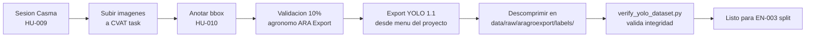

# EN-002 — Instalar y Configurar Herramienta de Anotación (CVAT)

| Campo | Valor |
|---|---|
| Tipo | Habilitador Técnico |
| Sprint | 2 |
| SP | 3 |
| Estado | 🟡 Setup documentado y listo · 🟡 Ejecución pendiente en máquina del usuario |
| Responsable | Daniel Morillas |
| Fecha | 2026-05-24 |

---

## Resumen

CVAT (Computer Vision Annotation Tool) v2.18 es la herramienta self-hosted que usaremos para anotar bounding boxes en las imágenes capturadas en Casma (HU-009 → HU-010). Exporta directamente al formato YOLO `.txt` consumible por YOLOv8.

Decidimos **no integrar CVAT en el `docker-compose.yml` principal** porque:

- CVAT levanta 6 servicios pesados (server, db propio, redis, opa, ui, traefik). Bakearlos siempre encendidos consume RAM innecesariamente fuera del Sprint 2.
- CVAT solo se usa durante la fase de anotación. Una vez exportado el dataset, se apaga.
- El equipo de CVAT mantiene su propio repo con docker-compose actualizado.

En su lugar: documentamos cómo clonar y levantar CVAT en una carpeta separada de la máquina.

## Archivos creados

- [`cvat/README.md`](../../../../cvat/README.md) — instrucciones completas de instalación, workflow de anotación y exportación a YOLO.

## Instalación (resumen)

```powershell
cd c:\
git clone https://github.com/cvat-ai/cvat.git
cd cvat
git checkout v2.18.0
$env:CVAT_HOST = "localhost"
docker compose up -d
docker exec -it cvat_server bash -ic 'python3 ~/manage.py createsuperuser'
# username = mangovision_admin, email = patrick.isla@..., password = (anotar)
start http://localhost:8080
```

Detalle completo y workflow de anotación en [`cvat/README.md`](../../../../cvat/README.md).

## Configuración del proyecto en CVAT

Antes de anotar, en la UI de CVAT (`http://localhost:8080`):

1. Crear proyecto **"MangoVision Casma 2026"**.
2. Definir las **5 labels** en este orden exacto (los IDs YOLO se asignan por orden de creación):

   | Orden / ID YOLO | Label name | Color |
   |---|---|---|
   | 1 (id 0) | `sano` | `#22C55E` |
   | 2 (id 1) | `antracnosis` | `#DC2626` |
   | 3 (id 2) | `oidio` | `#A855F7` |
   | 4 (id 3) | `pudricion_peduncular` | `#F97316` |
   | 5 (id 4) | `otras_lesiones` | `#FACC15` |

3. Cada sesión de captura (HU-009) genera una **task** dentro del proyecto, conteniendo las imágenes de ese día.

## Workflow de anotación → exportación → consumo



## Cómo validar EN-002 (criterios de aceptación)

Esta evidencia pasará de 🟡 a ✅ cuando el responsable (Daniel) ejecute:

```powershell
# 1. CVAT levantado
docker ps --filter "name=cvat" --format "table {{.Names}}\t{{.Status}}"
# Resultado esperado: 6 contenedores cvat_* en estado Up

# 2. UI accesible
curl -I http://localhost:8080
# Resultado esperado: HTTP/1.1 200 OK

# 3. Proyecto creado con las 5 labels en orden
# Capturar screenshot del proyecto y guardar en docs/sprints/sprint-2/evidencias/screenshots/EN-002-proyecto-cvat.png

# 4. Crear una task de prueba con 2-3 imágenes públicas y exportar a YOLO
# Verificar que los .txt usen los IDs 0-4 según el orden de labels
```

## Criterios verificados (parciales)

- [x] Decisión arquitectónica documentada (CVAT separado del compose principal).
- [x] Versión congelada (`v2.18.0` para reproducibilidad).
- [x] Mapeo explícito clase → ID YOLO documentado.
- [x] Workflow de anotación → exportación → consumo definido.
- [ ] CVAT levantado en máquina de desarrollo de Daniel (PENDIENTE).
- [ ] Proyecto "MangoVision Casma 2026" creado con las 5 labels (PENDIENTE).
- [ ] Test E2E con 2-3 imágenes y export YOLO verificado con `verify_yolo_dataset.py` (PENDIENTE).

## Notas técnicas

- **Conflicto de puertos:** CVAT usa el `8080`. Asegurarse que no choque con otra cosa en la máquina (nuestra API es `8000`, Vite `5173`, Postgres `55432`, MinIO `9000/9001`).
- **Memoria RAM:** CVAT requiere ~3 GB libres mientras corre. En máquinas con menos de 8 GB, apagar Docker de MangoVision (`docker compose down` desde BackMangoVision) antes de levantar CVAT.
- **Datos persistentes:** los volúmenes de CVAT viven en su propia carpeta `c:\cvat\`. Si se elimina ese folder se pierden los proyectos y anotaciones — hacer backup del `docker volume` antes de cualquier limpieza.
