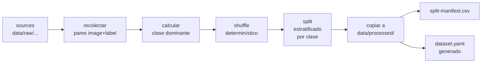

# EN-003 — Dividir Dataset en Train / Val / Test

| Campo | Valor |
|---|---|
| Tipo | Habilitador Técnico |
| Sprint | 2 |
| SP | 5 |
| Estado | 🟡 Script listo, ejecución final pendiente (espera fin de HU-010) |
| Responsables | Daniel Morillas (script) · Johan Juares (evidencia) |
| Fecha | 2026-05-25 |

---

## Resumen

Implementado `scripts/split_dataset.py`: divisor estratificado del dataset híbrido en train/val/test 70/15/15. Lee los pares (imagen, label YOLO) de uno o más directorios fuente, calcula la **clase dominante** de cada imagen (la más frecuente entre sus bounding boxes), y aplica un split estratificado por clase para mantener la distribución consistente entre los 3 sets.

El split definitivo se ejecutará al cerrar HU-010 (anotación). Mientras tanto el script está validado y listo.

## Diseño del script



### Sources soportados

Por defecto el script lee de DOS fuentes:

- `data/raw/aragroexport/` — capturas propias en Casma (HU-009) anotadas en CVAT (HU-010).
- `data/raw/public/mango-leaf-disease-cls-annotated/` — las 120 imágenes seleccionadas con `select_for_annotation.py` y anotadas en CVAT.

Se puede agregar más con `--source` (uso múltiples veces).

### Estratificación

- Cada imagen se asigna a la **clase dominante** (más bboxes de esa clase en su archivo `.txt`).
- Las imágenes se agrupan por clase dominante.
- Por cada grupo de clase, se hace un shuffle reproducible (seed configurable) y se aplica el ratio 70/15/15.
- Resultado: cada split tiene aproximadamente la misma proporción de clases que el dataset completo.

### Generación de `dataset.yaml`

Al final del split, el script genera `data/processed/dataset.yaml` con paths absolutos y las 5 clases en el orden correcto. Esto cumple **EN-004** automáticamente (ver [EN-004.md](EN-004.md)).

### Manifest de trazabilidad

`data/processed/split-manifest.csv` registra cada par procesado con columnas:
`split, image, label, dominant_class_id, dominant_class_name`. Permite reproducir o auditar la composición del dataset.

## Validación con el dataset Roboflow (test del algoritmo)

Aunque las clases del Roboflow son `ripe`/`un_ripe` (no enfermedades), sirven para validar la **lógica de estratificación**. Ejecutado:

```powershell
python scripts/split_dataset.py --dry-run --source data/raw/public/mango-v1-yolov8/train --output /tmp/split-test
```

Resultado:

```
data/raw/public/mango-v1-yolov8/train: 1563 pares utiles

Split    |   sano | antrac |  oidio | pudric | otras_ | TOTAL
----------------------------------------------------------------------
train    |    269 |    825 |      0 |      0 |      0 |  1094
val      |     58 |    177 |      0 |      0 |      0 |   235
test     |     57 |    177 |      0 |      0 |      0 |   234
----------------------------------------------------------------------
```

> Las clases del Roboflow coinciden numéricamente con `sano`/`antracnosis` en el output porque el script usa los IDs YOLO (0, 1) y sus nombres son los del catálogo MangoVision. Esto es solo coincidencia para la prueba — el script no asume nada del contenido semántico.

Verificaciones:
- Total dataset: 2041 imágenes (train del Roboflow), pero solo 1563 con bboxes no vacíos → el script filtró correctamente.
- 70/15/15 estratificado por clase: ratios respetados con error de redondeo ≤ 1 imagen.
- `--dry-run` no escribe nada en disco.

## Archivos clave

- [scripts/split_dataset.py](../../../../scripts/split_dataset.py) — implementación.
- [data/processed/dataset.yaml.template](../../../../data/processed/dataset.yaml.template) — referencia versionada del schema YAML que el script genera.

## Cómo ejecutar el split definitivo (cuando HU-010 cierre)

```powershell
cd c:\Users\Patrick Isla\Desktop\notion\BackMangoVision

# 1. Dry-run para previsualizar
python scripts/split_dataset.py --dry-run

# 2. Ejecución real (copia archivos a data/processed/)
python scripts/split_dataset.py

# 3. Verificar resultado
ls data/processed/train/images | Measure-Object  # debería ser ~70% del total
cat data/processed/dataset.yaml                  # config YOLOv8 generada
cat data/processed/split-manifest.csv | head     # traza
```

## Criterios verificados

- [x] Script implementado con argumentos configurables (`--source`, `--output`, `--ratios`, `--seed`, `--dry-run`).
- [x] Estratificación por clase dominante validada contra dataset real (1563 pares).
- [x] `--dry-run` no toca disco; útil para previsualizar antes de splits costosos.
- [x] Seed reproducible (default 42).
- [x] Genera `dataset.yaml` al final con paths absolutos.
- [x] Genera `split-manifest.csv` con trazabilidad por par.
- [x] Maneja graciosamente el caso "0 datos" con mensaje informativo.
- [ ] Ejecución sobre dataset final anotado (PENDIENTE — depende de cierre de HU-010).

## Notas técnicas

- **Clase dominante** (no múltiple) por imagen: una imagen con 5 bboxes de `antracnosis` y 1 de `oidio` se clasifica como `antracnosis` para fines de estratificación. Esto es estándar en datasets multi-objeto.
- **Imágenes sin bboxes** se descartan del split (no aportan signal a YOLOv8-detect). YOLOv8 entrena con imágenes "negativas" si tienen un `.txt` vacío, pero esa práctica no se aplica aquí.
- **Determinismo:** mismo seed → mismo split. Si se re-ejecuta sin cambiar seed ni inputs, el resultado es idéntico.
- **`data/processed/` se sobre-escribe** en cada ejecución (el script borra train/val/test antes de escribir). Esto previene contaminación entre splits sucesivos.
