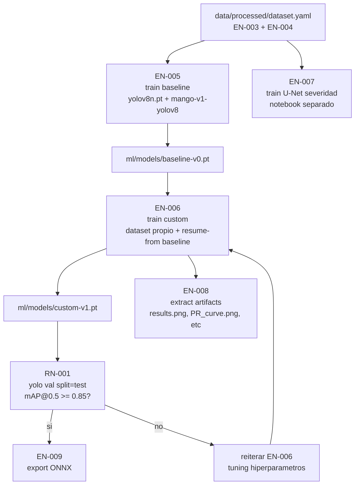

# Sprint 3 — Entrenamiento de Modelos IA

| Campo | Valor |
|---|---|
| Sprint | 3 de 5 |
| Duración planificada | 3 semanas (Semanas 7 a 9) |
| SP planificados | 47 |
| Sprint Goal | Entrenar YOLOv8 y U-Net con mAP@0.5 ≥ 0.85 y exportar el modelo final listo para integrarse al backend. |

## PBIs del Sprint

| ID | Título | SP | Estado | Evidencia |
|---|---|---|---|---|
| EN-005 | Entrenar YOLOv8 Baseline con Datos Públicos | 8 | 🟡 | [EN-005.md](evidencias/EN-005.md) — scripts listos |
| EN-006 | Entrenar YOLOv8 con Datos Propios | 13 | 🟡 | [EN-006.md](evidencias/EN-006.md) — depende de EN-003 cerrado |
| RN-001 | Alcanzar mAP@0.5 ≥ 0.85 en Test Set | 5 | ⏳ | [RN-001.md](evidencias/RN-001.md) — validación post EN-006 |
| EN-007 | Entrenar U-Net para Estimación de Severidad | 13 | ⏳ | [EN-007.md](evidencias/EN-007.md) — notebook por crear |
| EN-008 | Generar Artefactos de Evaluación del Modelo | 5 | 🟡 | [EN-008.md](evidencias/EN-008.md) — auto via extract_yolo_artifacts.py |
| EN-009 | Exportar Modelo Final a Ruta de Producción | 3 | ⏳ | [EN-009.md](evidencias/EN-009.md) — depende RN-001 cumplido |

## Scripts y herramientas listos

| Archivo | Propósito |
|---|---|
| [`scripts/train_yolo.py`](../../../scripts/train_yolo.py) | CLI para entrenar baseline + custom con auto-extracción al final |
| [`scripts/extract_yolo_artifacts.py`](../../../scripts/extract_yolo_artifacts.py) | Copia results.png + PR_curve.png + confusion_matrix.png + genera SUMMARY.md |
| [`ml/README.md`](../../../ml/README.md) | Workflows completos del sprint |

## Pipeline del sprint

## Requisitos antes de arrancar este sprint

- ✅ Sprint 2 cerrado: `data/processed/dataset.yaml` existe y `dataset.yaml` válido.
- ⏳ Cómputo con GPU disponible (local CUDA, Google Colab, Kaggle).
- ⏳ `pip install ultralytics` en el entorno de training (versión 8.x).

## Criterios de cierre del Sprint 3

- [ ] EN-005 ejecutado: baseline con mAP@0.5 reportada en evidencia.
- [ ] EN-006 ejecutado: modelo custom con dataset híbrido.
- [ ] RN-001: `yolo val ... split=test` reporta `mAP@0.5 ≥ 0.85`.
- [ ] EN-007: U-Net entrenado con métricas de IoU sobre segmentación.
- [ ] EN-008: gráficos copiados a `docs/sprints/sprint-3/evidencias/screenshots/<tag>/`.
- [ ] EN-009: `ml/models/custom-v1.onnx` generado y validado con inferencia de smoke test.
